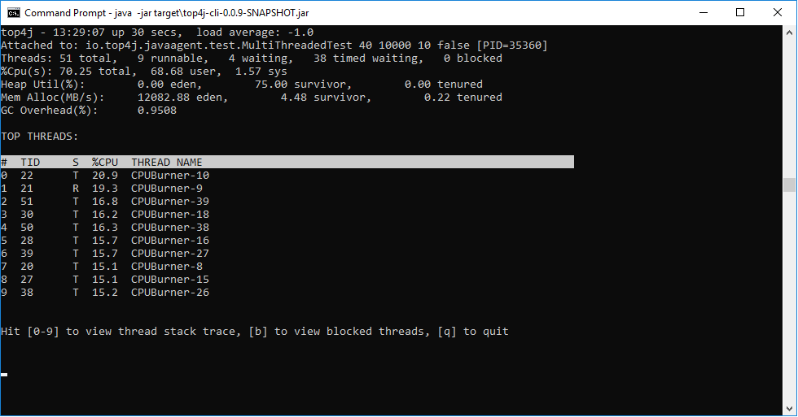
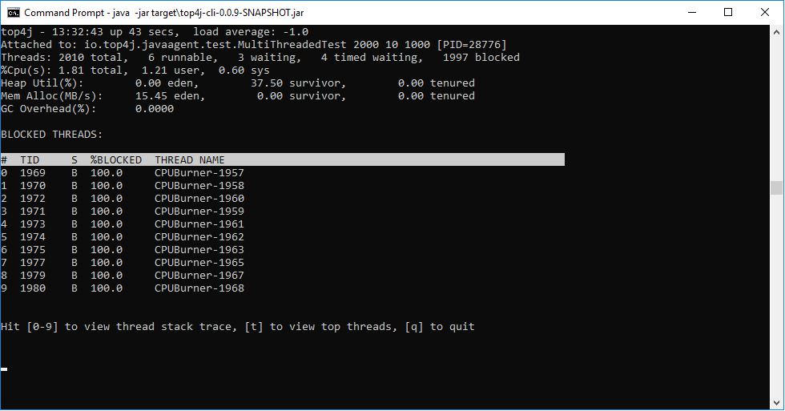
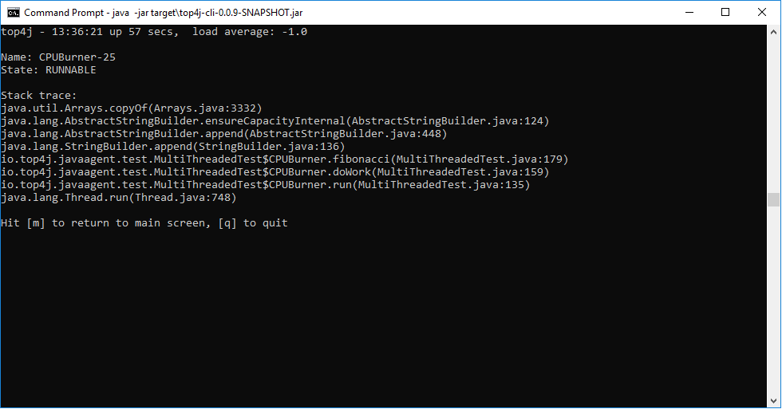
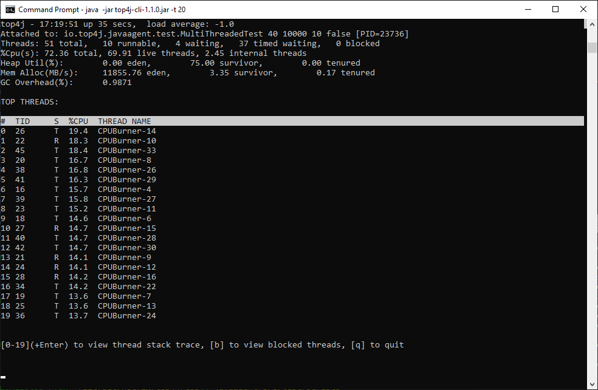
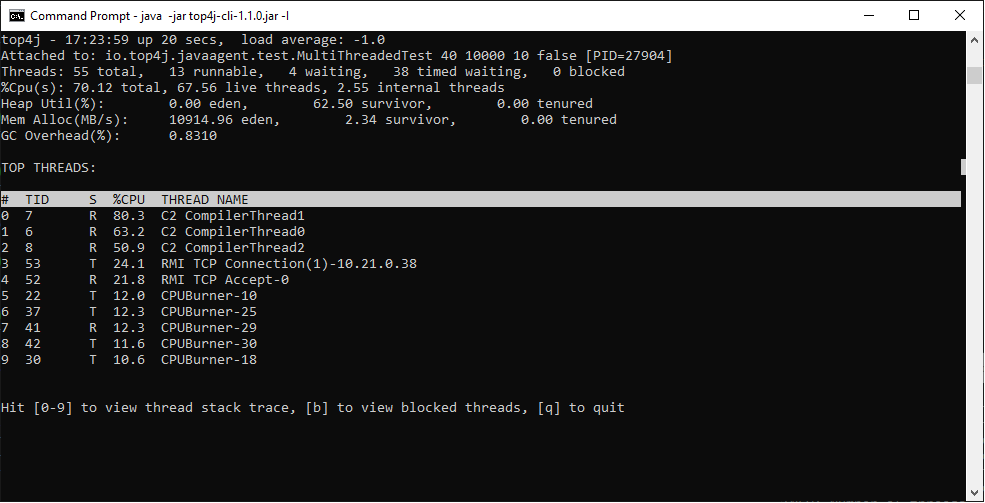

Screenshots
===========
**Screenshot of Top4J top threads screen using Remote Attach command line interface:**

**Screenshot of Top4J blocked threads screen using Remote Attach command line interface:**

**Screenshot of Top4J thread stack trace screen using Remote Attach command line interface:**

**Screenshot of Top4J top threads screen using -t command-line option to display more than 10 top threads:**

**Screenshot of Top4J top threads screen using -I command-line option to display system threads:**

